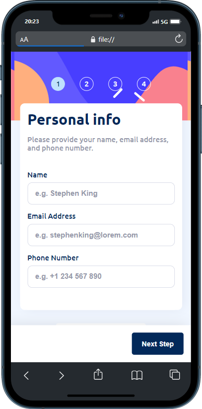

# Frontend Mentor - Multi-step form solution

This is a solution to the [Multi-step form challenge on Frontend Mentor](https://www.frontendmentor.io/challenges/multistep-form-YVAnSdqQBJ). Frontend Mentor challenges help you improve your coding skills by building realistic projects. 

## Table of contents

- [Overview](#overview)
  - [The challenge](#the-challenge)
  - [Screenshot](#screenshot)
  - [Links](#links)
- [My process](#my-process)
  - [Built with](#built-with)
  - [What I learned](#what-i-learned)
  - [Continued development](#continued-development)
- [Author](#author)
- [Acknowledgments](#acknowledgments)

**Note: Delete this note and update the table of contents based on what sections you keep.**

## Overview

### The challenge

Users should be able to:

- Complete each step of the sequence
- Go back to a previous step to update their selections
- See a summary of their selections on the final step and confirm their order
- View the optimal layout for the interface depending on their device's screen size
- See hover and focus states for all interactive elements on the page
- Receive form validation messages if:
  - A field has been missed
  - The email address is not formatted correctly
  - A step is submitted, but no selection has been made

### Screenshot

|  |  |
|:----------------------:|:----------------------:|

### Links

- Solution URL: [On github](https://your-solution-url.com)
- Live Site URL: [live preview](https://your-live-site-url.com)

## My process

### Built with

- Semantic HTML5 markup
- CSS custom properties
- Flexbox
- CSS Grid
- javascript


### What I learned

During this project I learned a lot, especially about CSS.
Usually we use css in the ordinary way except that there was a simpler way to write it: writing nested styles just as is the case with tags.
with this we are able to properly manage the scope of css logic.

````Css:
.parent{
  prop_1:val_1
  |
  |
  prop_n:val_n

  .children{
    prop_1:val_1;
  }
}
````

### Continued development

I hope to find other very informative challenges that will allow me to progress


## Author

- Website - [Arnold Nguechoung](https://github.com/escannord)
- Frontend Mentor - [@escannord](https://www.frontendmentor.io/profile/escannord)
- Twitter - [@ANguechoung](https://x.com/ANguechoung)


## Acknowledgments

I thank frontend mentor
